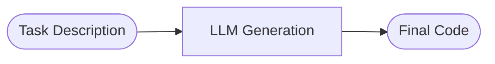
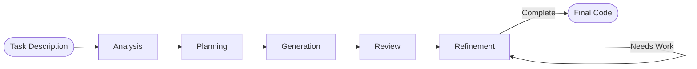
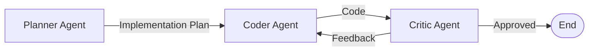

# LLM-for-SE: Code Generation Pipelines

This repository implements three different pipelines for automated code generation using Large Language Models (LLMs), developed for Project A2 (_Architectures for Code Development with LLMs_).

The goal is to compare different architectural approaches:
1.  **Naive Baseline**: One-shot generation.
2.  **Single-Agent**: Multi-step reasoning (LangGraph).
3.  **Multi-Agent**: Collaborative multi-role system.

## Architectures

### 1. Naive Baseline
A simple, direct approach where the LLM is given the task and asked to generate the solution in a single pass. This serves as the lower bound for performance comparison.



### 2. Single-Agent Pipeline (LangGraph)
A structured reasoning pipeline where a **single agent identity** performs multiple discrete steps. We use **LangGraph** to orchestrate this flow, forcing the model to think before coding and review its own work.

**Stages:**
*   **Analysis**: Understand the requirements.
*   **Planning**: Decompose the problem.
*   **Generation**: Write the code based on the plan.
*   **Review**: Execute the code, check quality metrics and review the code.
*   **Refinement**: Iteratively fixes the code based on the review feedback.



### 3. Multi-Agent System
A collaborative architecture with specialized agents, each having a distinct role and identity.

**Roles:**
*   **Planner Agent**: Analyzes the request and creates a detailed implementation plan.
*   **Coder Agent**: Writes code following the plan and feedback.
*   **Critic Agent**: Reviews the code, runs tests, and provides feedback to the Coder.



## Project Structure

```

scripts/
├── run_naive_agent.py      # Script to run naive baseline
├── run_single_agent.py     # Script to run single agent pipeline
├── run_multi_agent.py      # Script to run multi-agent pipeline
└── batch_test.py           # Script for batch testing

data/
├── test-tasks.json         # Sample tasks for evaluation
└── ...                     # Task categories (math, strings, etc.)

src/
├── core/
│   ├── llm.py                  # LLM interfaces and configuration
│   ├── state.py                # Global state definitions
│   ├── naive_baseline/
│   │   └── naive_agent.py      # Naive one-shot implementation
│   │
│   ├── single_agent/
│   │   ├── agent.py            # Step implementations and prompts
│   │   └── pipeline.py         # LangGraph workflow definition
│   │
│   └── multi_agent/
│       └── agents/
│           ├── planner/        # Planner agent logic
│           ├── coder/          # Coder agent logic
│           └── critic/         # Critic agent logic
│
├── tools/
│   └── executor.py             # Code execution sandbox
│
├── utils/
│   ├── code_parser.py          # Utilities for parsing code
│   ├── config.py               # Configuration management
│   ├── task_loader.py          # Loading tasks from data files
│   └── test_runner.py          # Running tests
│
└── evaluation/
    └── quality_metrics.py      # Static analysis metrics
```

## Model Selection

We use **local, quantized models via Ollama** to keep the project cheap, reproducible, and easy to run.

### Models Tested

1. **Qwen2.5-Coder-7B-Instruct**  
   _Primary single-agent baseline (best quality / cost tradeoff)_

2. **DeepSeek-Coder-V2-Lite (6.7B)**  
   _Small, fast comparison model_

3. **CodeLlama-7B-Instruct**  
   _Classic baseline for reference_

All models run locally through Ollama and can be swapped via configuration without changing the pipeline.

## Running the Sample Case

1. Start Ollama
    ```bash
    ollama serve
    ```

2. Pull a model
    ```
    ollama pull qwen2.5-coder:7b-instruct.
    ```
    
3. Install dependencies
    ```
    pip install -r requirements.txt
    ```

4. Run the pipelines

    **Naive Baseline**
    ```bash
    python -m scripts.run_naive_agent
    ```

    **Single-Agent Pipeline**
    ```
    python -m scripts.run_single_agent
    ```

    **Multi-Agent Pipeline**
    ```bash
    python -m scripts.run_multi_agent
    ```

### Common Flags

| Flag | Description | Default |
|------|-------------|---------|
| `--task-file` | Path to the input tasks JSON file | `data/test-tasks.json` |
| `--task-id` | Run a specific task by its ID | (Runs all) |
| `--model` | Specify the LLM model to use | `qwen2.5-coder:7b-instruct` |
| `--test-file` | Path to external tests file | None |
| `--verbose` | Show detailed execution logs (Multi-agent only) | False |

### Example
Sample Task (data/test-tasks.json)
```
[
  {
    "id": "smoke_test",
    "signature": "def add(a, b):",
    "docstring": "Return the sum of a and b.",
    "examples": [
      {
        "input": "2, 3",
        "output": "5"
      },
      {
        "input": "-1, 1",
        "output": "0"
      }
    ],
    "difficulty": "Easy"
  }
]
```

Expected Output (example)
```
def add(a, b):
    return a + b
```
