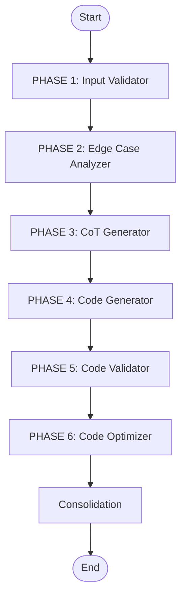

# Coder Agent - Multi-Node Code Generation Pipeline

## Overview

The **Coder Agent** is a specialized multi-node LLM agent responsible for generating production-grade Python code. It receives a detailed implementation plan from the Planner Agent and transforms it into correct, optimized, and well-structured code through a 6-phase pipeline.

## Architecture

### 6-Phase Pipeline



1.  **Input Validator**: Validates signature, plan, parameters.
2.  **Edge Case Analyzer**: Identify potential edge cases.
3.  **CoT Generator**: Create structured reasoning.
4.  **Code Generator**: Generate code using CoT as context.
5.  **Code Validator**: Check syntax & basic logic.
6.  **Code Optimizer**: Optimize code quality.
7.  **Consolidation**: Package final output.


## State Management

The `CoderAgentState` (TypedDict) tracks progression through all phases:

```python
# INPUT
task_id: str                                  # Unique task identifier
signature: str                                # Function signature to implement
plan: str                                     # Implementation plan from planner
model: str                                    # LLM model to use
show_node_info: bool                         # Verbose output flag

# ITERATION FEEDBACK
critic_feedback: Optional[str]               # Feedback from critic agent
exec_summary: Optional[str]                  # Execution summary from failures

# PHASE 1: INPUT VALIDATION
input_validation_errors: List[str]           # Validation errors found
should_proceed: bool                         # Flag to proceed or stop

# PHASE 2: EDGE CASE ANALYSIS
edge_cases: List[str]                        # Identified edge cases

# PHASE 3: CHAIN-OF-THOUGHT
cot_reasoning: str                           # Structured reasoning for code generation

# PHASE 4: CODE GENERATION
raw_code: Optional[str]                      # Generated code (before validation)

# PHASE 5: CODE VALIDATION
validated_code: Optional[str]                # Code after syntax validation
validation_errors: List[str]                 # Validation errors/warnings

# PHASE 6: CODE OPTIMIZATION
optimized_code: Optional[str]                # Final optimized code

# OUTPUT
code: Optional[str]                          # Final output (from consolidation)

# METADATA
errors: List[str]                            # All errors accumulated
```

## Node Descriptions

### Phase 1: Input Validator
**File:** `nodes/input_validator.py`

**Responsibility:** Validate inputs before processing.

**Checks:**
- Function signature syntax (starts with `def`, has parentheses, ends with `:`)
- Plan structure (not empty, sufficient detail)
- Required fields (task_id, model)

**Output:**
- `input_validation_errors`: List of validation errors
- `should_proceed`: Boolean flag (True if no errors)

**Why it matters:** Catches bad inputs early before expensive LLM calls. Prevents garbage-in-garbage-out downstream.

---

### Phase 2: Edge Case Analyzer
**File:** `nodes/edge_case_analyzer.py`

**Responsibility:** Identify edge cases and boundary conditions.

**Analysis:**
- Extracts type hints from function signature
- Uses LLM to analyze potential edge cases based on:
  - Input types (int, list, string, etc.)
  - Boundary values (empty, zero, negative, very large)
  - Domain-specific special cases from the plan

**Output:**
- `edge_cases`: List of identified edge cases (strings describing each case)

**Why it matters:** Guides code generator to handle edge cases explicitly, resulting in more robust code.

---

### Phase 3: CoT Generator
**File:** `nodes/cot_generator.py`

**Responsibility:** Generate chain-of-thought reasoning for structured problem solving.

**Generates:**
- Step-by-step breakdown of the problem
- Algorithm approach and reasoning
- Specific handling for each identified edge case
- References to the implementation plan

**Input context:**
- Signature, plan, edge cases
- Critic feedback (if iterating)
- Execution summary (if learning from failures)

**Output:**
- `cot_reasoning`: Detailed structured reasoning

**Why it matters:** Research shows CoT dramatically improves code quality. Guides code generator with explicit reasoning before implementation.

---

### Phase 4: Code Generator
**File:** `nodes/code_generator.py`

**Responsibility:** Generate Python code using all accumulated context.

**Uses context from all previous phases:**
- Function signature and plan
- Chain-of-thought reasoning
- Identified edge cases
- Critic feedback and execution summaries (if available)

**Output:**
- `raw_code`: Generated Python code
- Extracts Python code from LLM response using `extract_python_code()`

**Why it matters:** With full context and structured guidance, produces higher-quality code on first attempt. Can adapt to feedback from iterations.

---

### Phase 5: Code Validator
**File:** `nodes/code_validator.py`

**Responsibility:** Validate syntax and basic logic.

**Validation:**
- **Syntax:** Python AST parsing - catches syntax errors with line numbers
- **Logic checks:**
  - Infinite loops (detects `while True` without `break`)
  - Unreachable code (code after return at same indent)

**Acceptance policy:**
- Accepts code with warnings (logic issues)
- Rejects code with syntax errors

**Output:**
- `validated_code`: Code if syntax valid, None if invalid
- `validation_errors`: List of errors/warnings

**Why it matters:** Ensures generated code is syntactically correct before optimization. Prevents wasting compute on invalid code.

---

### Phase 6: Code Optimizer
**File:** `nodes/code_optimizer.py`

**Responsibility:** Optimize code for readability and performance.

**Improvements:**
- Variable naming clarity
- Algorithmic efficiency (when obvious improvements exist)
- Code structure and readability
- PEP 8 style compliance
- Comment quality

**Fallback policy:**
- If optimization fails, uses validated code without optimization
- Never fails the pipeline

**Output:**
- `optimized_code`: Final optimized Python code

**Why it matters:** Polish and readability matter. Final code should be maintainable and follow Python conventions.

---

### Consolidation
**File:** `pipeline.py` (consolidation_node function)

**Responsibility:** Package optimized code into final output.

**Actions:**
- Sets `code` to the optimized code
- Prepares for delivery to Critic Agent
- Reports generation status and line count

**Output:**
- `code`: Final output (ready for critic review)

## Usage

### Basic Usage

```python
from src.core.multi_agent.agents.coder.agent import CoderAgent

# Initialize agent (defaults to deepseek model)
coder = CoderAgent()

# Or specify a different model
coder = CoderAgent(model="deepseek")

# Generate code
result = coder.generate_code(
    task_id="task_001",
    signature="def solve(n: int) -> int:",
    plan="Your detailed plan from planner agent...",
    verbose=True  # Show phase-by-phase progress
)

# Check result
if result["success"]:
    print(f"Generated code:\n{result['code']}")
else:
    print(f"Error: {result['error']}")
```

### With Iteration (Critic Feedback)

```python
# First attempt
result = coder.generate_code(
    task_id="task_001",
    signature="def solve(n: int) -> int:",
    plan="..."
)

# If critic found issues, iterate with feedback
if not passes_critic_tests:
    result = coder.generate_code(
        task_id="task_001",
        signature="def solve(n: int) -> int:",
        plan="...",
        critic_feedback="The function doesn't handle negative numbers correctly...",
        exec_summary="Test failed: solve(-5) returned None instead of error"
    )
```

## Error Handling

Errors are accumulated in `state["errors"]` throughout the pipeline:

1. **Input Validation Fails:** Sets `should_proceed=False`, all downstream nodes skip
2. **Edge Case Analysis Fails:** Continues with empty edge cases, logs error
3. **CoT Generation Fails:** Continues with empty reasoning, logs error
4. **Code Generation Fails:** Returns None for raw_code, stops pipeline
5. **Validation Fails:** Returns None for validated_code, stops pipeline
6. **Optimization Fails:** Falls back to validated code, logs error

Final result includes first error message (if any) in `result["error"]`.

## Integration

The Coder Agent acts as the **Hands** of the pipeline, transforming plans into executable code.

- **Input**: Receives detailed implementation plans from the **Planner Agent**.
- **Output**: Delivers generated code to the **Critic Agent** for review.
