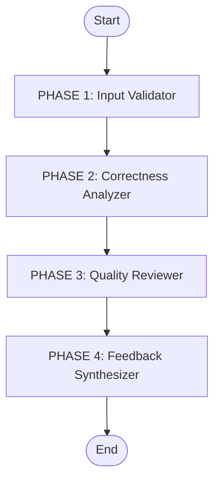

# Critic Agent - Multi-Node Code Review Pipeline

## Overview

The **Critic Agent** is a specialized multi-node LLM agent responsible for code review and quality assurance. It acts as a rigorous gatekeeper, validating generated code against functional requirements, correctness, and quality standards before it is accepted.

## Architecture

### 4-Phase Linear Pipeline



1.  **Input Validator**: Ensures all required inputs (code, plan, signature) are present.
2.  **Correctness Analyzer**: Rigorously checks for bugs, logic errors, and requirement violations.
3.  **Quality Reviewer**: Assesses code style, complexity, and maintainability (only runs if valid).
4.  **Feedback Synthesizer**: Prioritizes findings and generates actionable feedback for the Coder agent.

## State Management

The `CriticAgentState` (TypedDict) tracks the review process:

```python
# INPUT
task_id: str                          # Unique identifier
signature: str                        # Expected function signature
docstring: str                        # Expected docstring/behavior
plan: str                             # Implementation plan
code: str                             # Candidate code to review
model: str                            # LLM model to use
exec_summary: Optional[str]           # Execution output (if available)

# INTERNAL STATE
should_proceed: bool                  # Stop flag for validation errors
correctness_analysis: str             # Phase 2 output (Bugs/Logic)
quality_analysis: str                 # Phase 3 output (Style/complexity)

# FINAL OUTPUT
feedback: str                         # Synthesized critique
```

## Node Descriptions

### Phase 1: Input Validator
**File:** `nodes/input_validator.py`

**Responsibility:** Pre-flight checks.

**Checks:**
- Code is present
- Plan is present
- Signature is present

**Why it matters:** Prevents wasting tokens on incomplete or malformed requests.

---

### Phase 2: Correctness Analyzer
**File:** `nodes/correctness_analyzer.py`

**Responsibility:** Functional verification (The "Bad Cop").

**Analysis:**
- **Logic Verification:** Does code match the plan's logic?
- **Execution Analysis:** Interprets runtime errors from `exec_summary`.
- **Constraint Checking:** Verifies no forbidden operations (e.g., globals, I/O).
- **Edge Case Check:** Missed boundary conditions.

**Why it matters:** Functional bugs are show-stoppers. This node prioritizes finding them over style constraints.

---

### Phase 3: Quality Reviewer
**File:** `nodes/quality_reviewer.py`

**Responsibility:** Code hygiene (The "Good Cop").

**Analysis:**
- **Complexity:** Cyclomatic complexity checks (nested loops, depth).
- **Maintainability:** Variable naming, clarity, structure.
- **Pythonic Style:** PEP 8 compliance and idioms.

**Why it matters:** Ensures long-term maintainability. Complex code is a future bug.

---

### Phase 4: Feedback Synthesizer
**File:** `nodes/feedback_synthesizer.py`

**Responsibility:** Human-readable report generation.

**Logic:**
- **Prioritization:** If correctness fails, quality issues are secondary/ignored to keep focus on fixing the bug.
- **Clarity:** Converts abstract findings into specific "Change line X to Y" instructions for the Coder agent.

**Why it matters:** The Coder agent needs actionable instructions, not just a list of complaints.

## Error Handling

Errors are accumulated in `state["errors"]` and fail gracefully:

1.  **Input Failures**: If the `Input Validator` finds missing data (e.g., no code), the pipeline stops immediately.
2.  **Analysis Failures**: If the LLM fails to produce valid JSON for the correctness checking, we default to a "neutral" state rather than crashing, but flag the error in the execution logs.
3.  **Synthesis Fallback**: If the synthesizer fails, we return the raw findings from the Correctness/Quality nodes so the Coder at least gets *some* feedback.

## Usage

### Basic Usage

```python
from src.core.multi_agent.agents.critic.agent import CriticAgent

critic = CriticAgent(model="deepseek")

critique = critic.critique(
    task_id="task_123",
    signature="def factorial(n: int) -> int:",
    docstring="Calculate factorial of n",
    plan="Recursive implementation...",
    code="def factorial(n): return n * factorial(n-1)", # Missing base case
    exec_summary="RecursionError: maximum recursion depth exceeded",
    quality_metrics={ "cyclomatic_complexity": 5 } # Optional external metrics
)

print(critique)
```

## Integration

The Critic Agent pairs with the **Coder Agent**. It serves as the feedback loop in the iterative generation process.
- **Input:** Code from Coder + Execution results.
- **Output:** Feedback text fed back into Coder's "CoT Generator" for the next attempt.
