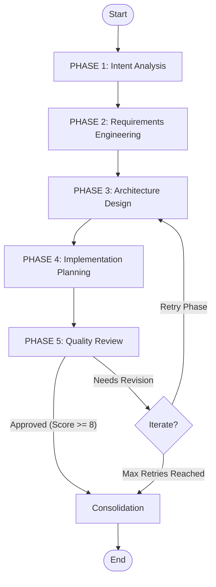

# Planner Agent - Multi-Node Planning Pipeline

## Overview

The **Planner Agent** is an autonomous multi-node LLM agent responsible for decomposing high-level user requests into comprehensive, production-grade implementation plans. It follows a Chain-of-Thought (CoT) approach, breaking the planning process into specialized phases to ensure depth, accuracy, and robustness.

Unlike simple "one-shot" planners, this agent uses a directed graph to progressively refine the plan, validating it at each step before handing it off to the Coder Agent.

## Architecture

### 5-Phase Pipeline with Feedback Loop



1. **Intent Analysis**: Extracts the core problem and success metrics.
2. **Requirements Engineering**: Defines functional/non-functional requirements & edge cases.
3. **Architecture Design**: Designs components, patterns, and data structures.
4. **Implementation Planning**: Creates atomic, step-by-step coding instructions.
5. **Quality Review**: Validates the plan against strict criteria.
6. **Consolidation**: Assembles the final approved plan.

## State Management

The `AgentState` (TypedDict) tracks the plan's evolution through the pipeline:

```python
# INPUT
task_id: str                          # Unique identifier
user_request: str                     # Original user prompt
model: str                            # LLM model in use
show_node_info: bool                  # Verbose output flag

# PHASES
intent_analysis: Dict                 # Output of Phase 1
requirements: Dict                    # Output of Phase 2
architecture: Dict                    # Output of Phase 3
implementation_plan: Dict             # Output of Phase 4
quality_review: Dict                  # Output of Phase 5

# FINAL OUTPUT
final_plan: Dict                      # Consolidated output
plan_approved: bool                   # Whether plan met quality standards

# METADATA
iteration_count: int                  # Rejection counter
errors: List[str]                     # Error log
```

## Node Descriptions

### Phase 1: Intent Analyzer
**File:** `nodes/intent_analyzer.py`

**Responsibility:** Distill the user's request into a structured problem definition.

**Output:**
- `intent`: Core problem statement
- `task_type`: Classification (e.g., algorithm, API, utility)
- `success_metrics`: Measurable goals
- `assumptions`: Implicit context made explicit

**Why it matters:** Prevents "XY Problems" by focusing on the underlying need rather than just the surface request.

---

### Phase 2: Requirements Engineer
**File:** `nodes/requirements_engineer.py`

**Responsibility:** Transform intent into testable specifications.

**Output:**
- `functional`: List of required behaviors
- `non_functional`: Performance, security, and reliability constraints
- `edge_cases`: Boundary conditions (empty inputs, large data, etc.)

**Why it matters:** Ensures the solution is robust and production-ready, not just a "happy path" prototype.

---

### Phase 3: Architecture Designer
**File:** `nodes/architecture_designer.py`

**Responsibility:** Design the technical blueprint.

**Output:**
- `components`: Single-responsibility modules
- `design_patterns`: Justified pattern selection
- `data_structures`: Optimal choices with complexity analysis (O(n))
- `exception_hierarchy`: Error handling strategy

**Why it matters:** Prevents spaghetti code by enforcing structure and separation of concerns before a single line is written.

---

### Phase 4: Implementation Planner
**File:** `nodes/implementation_planner.py`

**Responsibility:** Create a step-by-step guide for the Coder Agent.

**Output:**
- `implementation_order`: Dependency-aware sequence
- `steps`: Atomic actions for each component
- `validation`: Exact checks to implement
- `code_guidance`: Specific hints for complex logic

**Why it matters:** Reduces hallucination by giving the Coder Agent a strict recipe to follow.

---

### Phase 5: Quality Reviewer
**File:** `nodes/quality_reviewer.py`

**Responsibility:** Act as a gatekeeper for plan quality.

**Review Criteria:**
- **Completeness:** Are all requirements met?
- **Clarity:** Is it unambiguous?
- **Feasibility:** Is it implementable?

**Output:**
- `completeness_score`: 0-10 rating
- `approval_status`: `approved` or `needs_revision`
- `issues`: List of specific problems to fix

**Why it matters:** Ensures only high-quality plans reach the coding stage, saving compute and protecting code quality.

## Error Handling

Errors are tracked in `state["errors"]` and fail gracefully:

1.  **Refinement Limit**: The agent will retry up to 2 times if the Quality Reviewer rejects the plan. After that, it proceeds with a "best effort" plan to avoid infinite loops.
2.  **Phase Failures**: If a specific phase (e.g., Architecture) fails to generate valid JSON, the pipeline logs the error and attempts to continue or fail fast depending on severity.
3.  **Validation Gates**: The `should_refine` conditional edge ensures that we don't pass garbage to the consolidation phase unless we've exhausted our options.

## Usage

### Basic Usage

```python
from src.core.multi_agent.agents.planner import PlannerAgent

# Initialize
agent = PlannerAgent(model="deepseek")

# Run
plan = agent.create_plan(
    task_id="task_123",
    user_request="Create a thread-safe LRU cache with time-based expiration",
    verbose=True
)

# Check result
if plan.get("approved"):
    print(f"Plan approved! Score: {plan['quality_review']['completeness_score']}/10")
    print(f"Architecture: {len(plan['architecture']['components'])} components")
else:
    print("Plan generated (Best Effort)")
```

## Integration

The Planner Agent is the **Brain** of the pipeline. It feeds the **Coder Agent** (the Hands), which executes the plan. The high-fidelity plan serves as the context window for code generation, drastically reducing the chance of errors.
