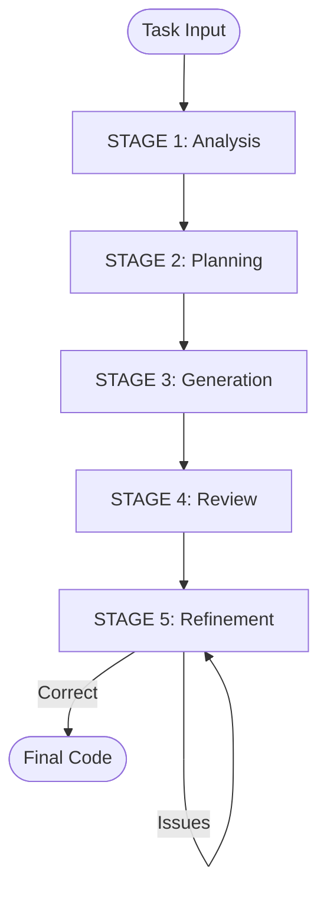

# Single-Agent Pipeline - Multi-Stage Code Generation

## Overview

The **Single-Agent Pipeline** implements structured code generation through **5 sequential stages** using a **single LLM identity**. Unlike naive one-shot generation, this system forces the model to reason through analysis, planning, generation, review, and refinement phases.

**Key Distinction**: One agent, multiple stages (not multiple agents with distinct roles).

## Architecture

### 5-Stage Sequential Pipeline



1. **Analysis**: Understand requirements, constraints, edge cases
2. **Planning**: Design solution approach (no code)
3. **Generation**: Produce executable Python code
4. **Review**: Execute code + compute quality metrics + evaluate correctness
5. **Refinement**: Fix issues iteratively (max 3 iterations)

## State Management

The `AgentState` (TypedDict) tracks progression:

```python
# INPUT
task_id: str
signature: str
docstring: str
examples: Optional[str]
model: str
show_node_info: Optional[bool]

# STAGE OUTPUTS
analysis: Optional[str]           # Stage 1
plan: Optional[str]               # Stage 2
code: Optional[str]               # Stage 3
exec_result: Optional[dict]       # Stage 4
quality_metrics: Optional[dict]   # Stage 4
review: Optional[str]             # Stage 4
refinement_count: Optional[int]   # Stage 5
```

## Stage Descriptions

### Stage 1: Analysis Node

**File:** `src/core/single_agent/agent.py::analyze_task()`

**Responsibility:** Deep task understanding.

**Output:**

- Required behavior
- Input/output expectations
- Constraints (time, space, values)
- Edge cases
- Common pitfalls

**Critical Rule:** No code allowed in analysis phase.

---

### Stage 2: Planning Node

**File:** `src/core/single_agent/agent.py::plan_solution()`

**Responsibility:** Solution strategy without implementation.

**Output:**

- High-level approach
- Step-by-step logical plan
- Edge case handling strategy
- Data structures and state
- Complexity considerations

**Critical Rule:** No code or pseudocode allowed.

---

### Stage 3: Generation Node

**File:** `src/core/single_agent/agent.py::generate_code()`

**Responsibility:** Generate executable Python code.

**Output:** Complete Python function matching signature exactly.

**Rules:**

- ONLY Python code (no markdown, comments, explanations)
- Match signature exactly
- Follow the plan
- Handle all edge cases

---

### Stage 4: Review Node

**File:** `src/core/single_agent/agent.py::review_code()`

**Responsibility:** Evaluate correctness and quality.

**Analysis:**

- **Execution Results**: Success/failure, errors
- **Signature Compliance**: Name, parameters match
- **Logical Correctness**: Static code inspection
- **Edge Case Coverage**: Missing cases
- **Code Quality**: Maintainability Index, Cyclomatic Complexity, Halstead metrics
- **Constraint Violations**: Unexpected I/O, globals

**Quality Metrics:**

- Maintainability Index: 0-100 (≥80 Excellent, ≥60 Good, ≥40 Moderate, <40 Poor)
- Cyclomatic Complexity: (≤5 Simple, ≤10 Moderate, >10 Complex)
- Lines of Code: Total and logical lines

**Verdict:**

- `"Code is correct"` → Functional correctness achieved
- `"Code has issues"` → Bugs, logic errors, or execution failures

**Critical Rule:** Quality metrics do NOT affect verdict—only functional correctness does.

---

### Stage 5: Refinement Node

**File:** `src/core/single_agent/pipeline.py::refinement_node()`

**Responsibility:** Iterative improvement.

**Strategy:**

- Early exit if "Code is correct"
- Max 3 refinement iterations
- Each iteration: refine → execute → review
- Quality metrics computed only on final iteration

**Refinement Priorities:**

1. Fix correctness issues (bugs, logic errors)
2. Handle edge cases
3. Improve quality (reduce complexity, improve maintainability)
4. Enhance readability

---

## Usage

### Basic Usage

```bash
# Run with default test tasks
python -m scripts.run_single_agent

# Specify task file
python -m scripts.run_single_agent --task-file data/strings/strings-tasks.json

# Run specific task
python -m scripts.run_single_agent --task-file data/strings/strings-tasks.json --task-id count_vowels

# Show detailed output
python -m scripts.run_single_agent --show-node-info

# Run external tests
python -m scripts.run_single_agent --task-id count_vowels --test-file data/strings/strings-tests.py

# Change model
python -m scripts.run_single_agent --model deepseek-coder-v2:16b
```

## File Structure

```
src/core/single_agent/
├── agent.py          # Cognitive functions (analyze, plan, generate, review, refine)
└── pipeline.py       # LangGraph orchestration

src/core/
├── llm.py            # LLM runtime
└── state.py          # AgentState definition

scripts/
└── run_single_agent.py  # Single task runner
```
